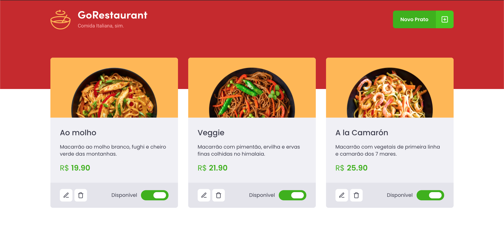

# GoRestaurant

## :rocket: Sobre

<p>O GoRestaurant é uma desafio feito pela rocketseat com o objetivo de praticar o conceito de CRUD (Create, Read, Update e Delete) que vai controlar quais refeições estão disponíveis e quais estão indisponíveis.

## Preview



### Funcionalidades:

- Listar os pratos de comida da fake API;
- Adicionar novos pratos de comida;
- Editar pratos de comida já existentes;
- Remover pratos de comida existentes;
- Alterar a disponibilidade dos pratos de comida.
  
### :computer: Tecnologias
Este projeto utiliza as seguintes tecnologias:

- ReactJS
- Typescript
- Styled Components
- Json-server
- Axios

## Como rodar o projeto
```bash
# Clone o projeto
$ git clone https://github.com/augustodevjs/challenge-04-reactjs-ignite

# Instale todas as depedências
$ yarn

# Rode o json-server
$ yarn server

# Rode o projeto
$ yarn start

# O servidor vai ser inicializado no <http://localhost:8080/>
```

# License
© Desafio feito pela [Rocketseat](https://www.linkedin.com/school/rocketseat/) e feito por [João Augusto](https://www.linkedin.com/in/joaoaugustodevjs/) 🤝
